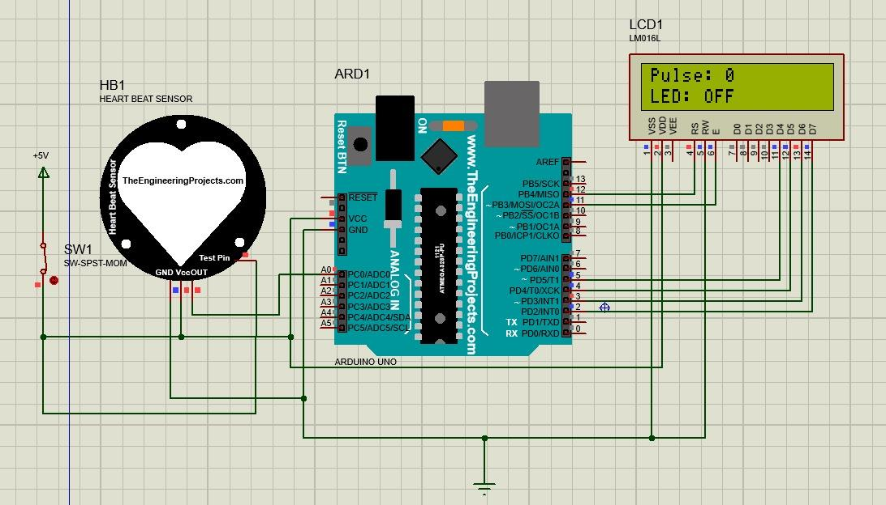
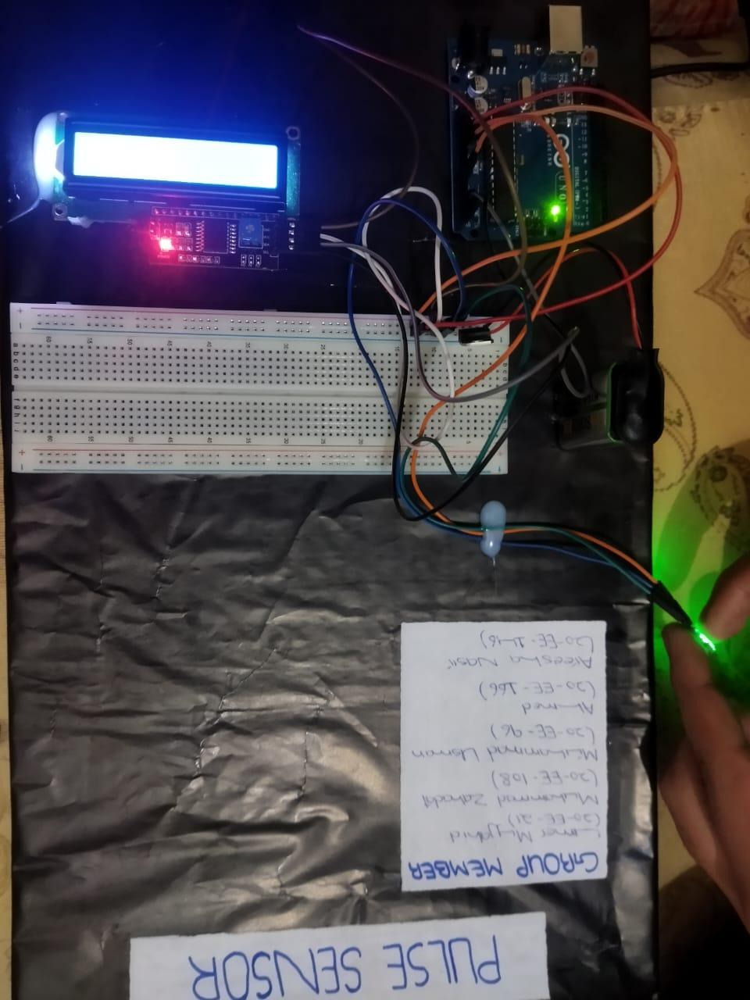

# Pulse Sensor using Arduino UNO

A photoplethysmogram (PPG) heart-rate monitor built around a Pulse Sensor Amped and an Arduino Uno, with real-time BPM shown on a 16x2 I2C LCD and the serial monitor — designed as an Instrumentation & Measurement Complex Engineering Problem (CEP).

**Authors:** Muhammad Umer Mujahid, Muhammad Usman, Muhammad Zahadat, Areesha Nasir, Ahmed Warraich
**Course:** Instrumentation and Measurement (INM) — Complex Engineering Problem (CEP)
**Instructor:** Dr. Hammad Shaukat · University of Engineering and Technology, Taxila · December 2023

## Objective

Design, simulate, and implement a simple, low-cost, non-invasive pulse sensor that measures heart rate accurately and reliably using an Arduino Uno, then validate it against a commercial pulse oximeter. Specific goals:

- Select and justify the sensor and components for the design.
- Design and simulate the circuit in Proteus.
- Implement and test the sensor on a breadboard.
- Display and visualize the sensor output on an LCD screen.
- Evaluate accuracy and reliability against a commercial reference device.

## Components

Pulse Sensor Amped · Arduino Uno (ATmega328P) · 16x2 I2C LCD · breadboard & jumper wires · 9V battery + voltage regulator (for standalone power)

## System Architecture

| Arduino pin | Connected to | Function |
|---|---|---|
| A0 | Pulse Sensor signal (purple wire) | Analog PPG input, sampled every 2 ms via a Timer2 interrupt (500 Hz) |
| 13 | Onboard LED | Blinks in sync with each detected heartbeat |
| A4 (SDA) / A5 (SCL) | 16x2 I2C LCD (addr `0x27`) | Displays "Heart-Beat Found" and the live BPM reading |
| USB / 9V + regulator | Power rail | Powers the Arduino and sensor (sensor runs on 3.3–5.5 V, <4 mA) |

The Pulse Sensor Amped clips onto a fingertip or earlobe and outputs an analog PPG signal: its built-in green LED and photodetector pick up the tiny changes in reflected light caused by blood volume changing with each heartbeat, and an onboard amplifier/noise-cancellation stage cleans up the signal before it reaches A0.

## How It Works

**Signal acquisition.** A Timer2 interrupt fires every 2 ms (500 Hz sample rate) and reads the raw analog signal from the sensor. Each sample is checked against a running peak (`P`) and trough (`T`) to track the shape of the pulse wave.

**Beat detection.** A dynamically-updated threshold (`thresh`, reset to 50% of the wave's amplitude after each beat) determines the instant a heartbeat occurs. When the signal crosses the threshold, the interrupt records the inter-beat interval (`IBI`), blinks the onboard LED, and flags a new heartbeat.

**BPM calculation.** The last 10 IBI values are kept in a rolling buffer; their average is converted to beats-per-minute with `BPM = 60000 / average_IBI`. The first two beats are used only to seed the buffer and are discarded from the BPM calculation to avoid a wild startup reading.

**Output.** Once a beat is confirmed, "Heart-Beat Found" and the current BPM are pushed to both the I2C LCD and the serial monitor.

## Simulation & Hardware Results

The circuit was first laid out and verified in Proteus, then built on a breadboard with the Pulse Sensor Amped, Arduino Uno, and I2C 16x2 LCD:

Live output on both the LCD and serial monitor confirmed correct beat detection:

**Accuracy testing.** The sensor was tested on 4 volunteers of varying age, skin tone, and health condition, each sitting still for 5 minutes with the sensor on their left index finger:

| Volunteer | Age | Skin Color | Health Condition | Pulse Sensor (BPM) |
|---|---|---|---|---|
| 1 | 20 | Fair | Healthy | 76 |
| 2 | 22 | Dark | Asthma | 118 |
| 3 | 18 | White | Hypertension | 98 |
| 4 | 24 | Dark | Healthy | 69 |

Compared against a commercial pulse oximeter, the sensor averaged **3.2% error** with a **2.1% standard deviation**, and no clear correlation was found between error and either age or skin color.

**Known sources of error:** sensor placement/contact pressure on the finger, ambient light interference, skin tone affecting light absorption, motion artifacts, electrical noise from the board/LCD, and approximations in the BPM calibration algorithm.

**Limitations:** the sensor struggles with low blood pressure or poor circulation, isn't well suited to continuous/long-term wear, and isn't accurate enough for clinical use — it's built for accessible, everyday heart-rate monitoring rather than medical diagnosis.

## Applications

- Personal health monitoring and fitness tracking
- Biofeedback applications
- Low-cost educational demonstration of PPG-based sensing

## Tools

Arduino IDE (C/C++) · Proteus (circuit simulation) · `Wire.h` / `LiquidCrystal_I2C` library

## Repository Contents

- `Pulse Sensor using Arduino.pdf` — full CEP report: problem statement, literature review, sensor justification, circuit design, results, and datasheets.
- `PulseSensor.ino` — Arduino sketch (interrupt-driven pulse detection + I2C LCD/serial output).
- `pulse-circuit-diagram.png` — Proteus schematic of the sensor/Arduino/LCD wiring.
- `pulse-hardware-build.png` — the breadboard build.
- `pulse-serial-monitor-output.png` — live BPM readout from the serial monitor.

## References

1. [TechTarget — Sensor definition](https://www.techtarget.com/whatis/definition/sensor)
2. [Electronics Hub — Different Types of Sensors](https://www.electronicshub.org/different-types-sensors)
3. [How2Electronics — Pulse Rate (BPM) Monitor using Arduino & Pulse Sensor](https://how2electronics.com/pulse-rate-bpm-monitor-arduino-pulse-sensor/)
4. [passion-tech/Hello-tech — Pulse_Sensor_Code_with_I2C_Lcd.ino (GitHub)](https://github.com)
5. [IRJ Web — Heart Beat Sensor with Arduino, Heart Rate Monitor System (PDF)](https://www.irjweb.com)
